# Documentación Técnica: Proyecto Vékiar

> Guía maestra del proyecto. Cubre la arquitectura completa, el flujo de ejecución, el pipeline de renderizado, el sistema de marcadores, las dependencias y las trampas conocidas. Actualizada al estado actual del código.

---

## Índice

1. [Stack Tecnológico](#1-stack-tecnológico)
2. [Estructura de Directorios](#2-estructura-de-directorios)
3. [Flujo de Arranque (Boot Flow)](#3-flujo-de-arranque-boot-flow)
4. [Máquina de Estados de la Cámara](#4-máquina-de-estados-de-la-cámara)
5. [Pipeline de Renderizado](#5-pipeline-de-renderizado)
6. [Sistema de Texturas Empacadas](#6-sistema-de-texturas-empacadas)
7. [Pipeline de la GPU (Shaders)](#7-pipeline-de-la-gpu-shaders)
8. [Sistema de Marcadores (MarkerManager)](#8-sistema-de-marcadores-markermanager)
9. [Sistemas de Ecosistemas](#9-sistemas-de-ecosistemas)
10. [Dependencias y Restricciones de Entorno](#10-dependencias-y-restricciones-de-entorno)
11. [Trampas Conocidas y Decisiones de Diseño](#11-trampas-conocidas-y-decisiones-de-diseño)

---

## 1. Stack Tecnológico

| Capa | Tecnología | Versión |
|---|---|---|
| Motor 3D | Three.js | v0.160.0 |
| Lenguaje | JavaScript ES Modules (ESM) | nativo del browser |
| Módulos de Three | `OrbitControls`, `CSS2DRenderer` | via `three/addons/` |
| CSS | Vanilla CSS (archivos separados por módulo) | — |
| Paralelismo | Web Workers nativo (HTML5) | — |
| Módulos extra | Ninguno. Sin bundler, sin npm, sin build step. | — |

> **IMPORTANTE**: El proyecto corre **sin bundler**. Todo se resuelve vía `importmap` en `index.html` apuntando a unpkg CDN. Esto significa que **siempre debe correrse bajo un servidor HTTP** (ej: `python -m http.server 8080`). Si se abre `index.html` directo desde el sistema de archivos (`file://`), los Web Workers y las texturas lanzarán error CORS y el mapa no cargará.

---

## 2. Estructura de Directorios

```
vekiar/
├── index.html                  # Entry point HTML + importmap de Three.js
├── ARCHITECTURE.md             # Este archivo
│
├── css/
│   ├── style.css               # Reset global (body, canvas)
│   ├── Ui.css                  # Pantalla idle y botón "Comenzar"
│   ├── Compass.css             # Brújula flotante
│   ├── loader.css              # Pantalla de carga con barra de progreso
│   ├── MapEditor.css           # Panel del editor de marcadores (tecla E)
│   └── markers.css             # Estilos de etiquetas CSS2D por tipo de marcador
│
├── assets/
│   └── images/
│       ├── base_color_map.jpg
│       ├── map_data_R_elevation_B_snow_particles.png
│       ├── masks_1_R_river_G_lake_B_snow.png
│       ├── water_noise_distortion.jpg
│       ├── river_flow_directions.png
│       └── source_assets/      # Backups e imágenes de experimentación (no se cargan)
│
└── js/
    ├── main.js                 # Orquestador principal (instancia + bucle animate)
    ├── ResponsiveManager.js    # Escucha resize y notifica a suscriptores
    │
    ├── state/
    │   └── AppState.js         # Reloj global, zoomAlpha, LOD update, isReady gate
    │
    ├── scene/
    │   ├── SceneManager.js     # THREE.Scene, WebGLRenderer, CSS2DRenderer, luces
    │   ├── Map.js              # Ensambla el mapa: chunks LOD, rollos, unfurl
    │   ├── TerrainMaterial.js  # MeshStandardMaterial + inyección de shaders propios
    │   ├── MarkerManager.js    # Crea/elimina marcadores 3D y etiquetas CSS2D
    │   ├── MapEditor.js        # Editor de marcadores en runtime (tecla E)
    │   └── Clouds.js           # Nubes perimetrales decorativas
    │
    ├── controls/
    │   ├── CameraController.js # OrbitControls extendido + máquina de estados + límites
    │   └── RaycasterBounds.js  # Clampea el pan usando frustum vs bordes del mapa
    │
    ├── systems/
    │   ├── OceanSystem.js      # Actualiza uniforms del océano/ríos por frame
    │   ├── LandSystem.js       # Actualiza uniforms de la tierra por frame
    │   ├── SnowSystem.js       # 25k partículas de nieve + PointLight pulsante
    │   └── PermafrostMistMaterial.js  # Material aditivo de niebla helada
    │
    ├── shaders/
    │   ├── TerrainShader.js    # Orquestador: exporta los chunks GLSL inyectables
    │   ├── CloudShader.js      # Vertex + fragment de las nubes
    │   ├── SnowShader.js       # Vertex + fragment de las partículas de nieve
    │   ├── PermafrostMistShader.js
    │   ├── MountainGlowShader.js
    │   └── chunks/
    │       ├── LandChunk.js    # GLSL: color de tierra, nieve acumulada en suelo
    │       └── WaterChunk.js   # GLSL: océano, caústicas, foam, ríos, lagos
    │
    ├── utils/
    │   └── AssetLoader.js      # Carga paralela de texturas con reporte de progreso
    │
    └── workers/
        └── mapWorker.js        # Hilo separado: convierte heightmap PNG → geometría 3D
```

---

## 3. Flujo de Arranque (Boot Flow)

El arranque es **estrictamente secuencial y asíncrono**. Cada fase depende de que la anterior haya terminado.

```mermaid
graph TD
    A["index.html (importmap + link CSS)"] --> B["main.js — Instancia clases base"]
    B --> C["SceneManager — THREE.Scene + WebGLRenderer + CSS2DRenderer + luces"]
    B --> D["Map (vacío) — Espera assets"]
    B --> E["CameraController — OrbitControls + máquina de estados (INIT)"]
    B --> F["AppState — isReady = false"]
    C --> G["SceneManager.initializeVekiar()"]
    G --> H["AssetLoader.loadVekiarAssets() — Carga paralela de 5 texturas"]
    H --> I["Map.build(assets) — Lanza mapWorker.js en hilo separado"]
    I --> J["mapWorker.js — Convierte canal R (heightmap) en 64 chunks de geometría 3D con normales suavizadas"]
    J --> K["Map.js recibe geometría — Arma LODs + clipping planes. mapGroup.rotation.x = -PI/2"]
    K --> L["TerrainMaterial.create() — MeshStandardMaterial + onBeforeCompile"]
    L --> M["Sistemas iniciados — Ocean, Land, Snow, PermafrostMist"]
    M --> N["Loader fade-out — cameraController.playIntro() + appState.setTerrainReady()"]
    N --> O["MapEditor.initLoadedMarkers() — MarkerManager.renderAll()"]
    O --> P["animate() loop — rAF continuo"]
```



### Orden de instanciación en `main.js`

```
1. AppState          — solo inicializa propiedades, sin side effects
2. ResponsiveManager — escucha window resize, notifica por callback
3. SceneManager      — crea scene, WebGLRenderer, CSS2DRenderer, monta en DOM
4. Map               — constructor vacío (no carga nada todavía)
5. Clouds            — geometría de nubes decorativas
6. CameraController  — OrbitControls, estado INIT, limita movimiento
7. RaycasterBounds   — clampea pan proyectando el frustum al plano Y=0
8. Compass           — lee el ángulo de OrbitControls, actualiza el div del DOM
```

Después de `startApp()` (async):
```
9.  AssetLoader.loadVekiarAssets()     — await, carga las 5 texturas en paralelo
10. Map.build(assets)                  — await, espera que el Worker termine
11. MapEditor instanciado              — recibe scene, camera, mapPlane, materiales
12. mapEditor.initLoadedMarkers()      — renderAll() de marcadores guardados en localStorage
13. animate() arranca                  — bucle rAF desde aquí en adelante
```

---

## 4. Máquina de Estados de la Cámara

`CameraController` tiene una máquina de estados que controla la **intro cinemática** antes de entregar el control al usuario.

```
INIT ──playIntro()──► DROP_1 ──llegó a idleDist──► WAIT_INPUT ──btn-start──► DROP_2 ──llegó a playableDist──► PLAYING
```

| Estado | Descripción | Controles |
|---|---|---|
| `INIT` | Estado inicial antes de que cargue el mapa | Todo bloqueado |
| `DROP_1` | Cámara cae de Y=140 a `idleDist`. El mapa se desenvuelve (`updateUnfurl`) sincronizado al progreso de la caída | Zoom y pan desactivados |
| `WAIT_INPUT` | Cámara fija en `idleDist`. Se muestra el prompt "Explorar Vékiar" | Solo aparece el botón |
| `DROP_2` | Al presionar el botón, cámara cae a `playableDist` | Zoom desactivado durante la caída |
| `PLAYING` | Control total entregado al usuario | Pan + zoom activos. Se muestra la brújula. |

### Variables clave de `CameraController`

- **`zoomAlpha`** (`0.0` = máximo zoom in, `1.0` = máximo zoom out): calculado cada frame como `(dist - minDist) / (maxDist - minDist)`. Todos los sistemas lo consumen para blending.
- **`calculatedMaxDistance`**: calculado a partir del FOV y el aspect del mapa para que en zoom máximo la cámara justo cubra el mapa sin ver vacío.
- **Ángulo polar**: se lockea dinámicamente. Zoom cerca → perspectiva isométrica (`PI/4.5`). Zoom lejos → top-down (`0.01`). Transición con `easeInOut`.

### Restricción de Pan (`RaycasterBounds`)

Cada frame, `RaycasterBounds` proyecta los 4 vértices de la pantalla contra el plano `Y=0`. Si el frustum se sale del borde del mapa, aplica un `delta` al target y a la posición de la cámara para empujarlo de vuelta. Opera en paralelo con `CameraController.update()`.

---

## 5. Pipeline de Renderizado

Cada frame de `animate()` ejecuta en este orden:

```
1. cameraController.update(aspect)
       └─ Máquina de estados, zoomAlpha, ángulo polar, límites de pan

2. appState.update(timeMs, cameraController, map, camera)
       └─ Avanza el reloj (time)
       └─ Calcula currentIn3DAlpha (smooth de zoomAlpha invertido)
       └─ Actualiza LODs de los 64 chunks

3. Lógica de nubes (opacidad con lerp según estado PLAYING/otro)

4. clouds.update(target)  — solo si opacidad > 0.001

5. raycasterBounds.update(aspect)

6. compass.update()  — rota el div del brújula según azimut de la cámara

7. sceneManager.update(appState)
       └─ sunLight.intensity según currentIn3DAlpha
       └─ vignette opacity via DOM

8. Uniforms del terreno (desde main.js):
       └─ uZoomAlpha, uTime, displacementScale (× 3.5 × currentIn3DAlpha)
       └─ riverMaterial y lakeMaterial también reciben displacementScale

9. Sistemas del ecosistema:
       └─ map.snowSystem.update(appState)   — pulsa la PointLight de nieve
       └─ map.oceanSystem.update(appState)  — actualiza uniforms del océano
       └─ map.landSystem.update(appState)   — actualiza uniforms de la tierra
       └─ map.update(time)                  — actualiza uTime de los rollos de pergamino

10. sceneManager.render()
        └─ renderer.render(scene, camera)       — WebGL / geometría 3D
        └─ css2dRenderer.render(scene, camera)  — DOM / etiquetas de marcadores
```

---

## 6. Sistema de Texturas Empacadas

El mapa no usa modelos `.obj`. La geometría, el color y todas las máscaras se derivan de **PNG empacados por canal** para maximizar rendimiento (1 fetch = 4 máscaras).

| Textura | Canal R | Canal G | Canal B | Canal A |
|---|---|---|---|---|
| `base_color_map.jpg` | Color base RGB | — | — | — |
| `map_data_R_elevation_B_snow_particles.png` | **Heightmap** (eleva vértices) | — | **Máscara de partículas de nieve** (spawn mask) | — |
| `masks_1_R_river_G_lake_B_snow.png` | **Ríos** | **Lagos** | **Nieve acumulada** (shader de suelo) | Libre |
| `water_noise_distortion.jpg` | Ruido de distorsión | — | — | — |
| `river_flow_directions.png` | Dirección de flujo X | Dirección de flujo Y | — | — |

> **TIP**: El canal A de `masks_1` está **libre y disponible** para agregar una quinta máscara sin agregar un fetch extra.

### Cómo usa el Worker el heightmap

`mapWorker.js` recibe el `ImageData` del canal Rojo vía `postMessage`. Lo divide en una grilla de **8×8 = 64 chunks**, cada uno con **3 niveles de LOD** (64, 32 y 16 segmentos). Para cada vértice, el valor del pixel (0–255) determina su altura Z. Las normales se calculan en el worker para no bloquear el hilo principal. Ventaja: Three.js hace Frustum Culling automático sobre los 64 chunks independientes.

---

## 7. Pipeline de la GPU (Shaders)

El terreno usa `THREE.MeshStandardMaterial` (PBR nativo) **hackeado** con `onBeforeCompile`. Esto conserva la iluminación física realista de Three.js e inyecta matemática propia en los puntos exactos del pipeline GLSL.

### Puntos de inyección en el Vertex Shader

| `#include` reemplazado | Por qué |
|---|---|
| `<common>` | Declara uniforms y varyings propios (uTime, uZoomAlpha, vGlobalPos, etc.) |
| `<uv_vertex>` | Pasa las UVs a varyings para uso en el fragment shader |
| `<begin_vertex>` | Aplica el displacement del heightmap a la posición del vértice |
| `<worldpos_vertex>` | Calcula y pasa la posición global del vértice (`vGlobalPos`) |

### Puntos de inyección en el Fragment Shader

| `#include` reemplazado | Por qué |
|---|---|
| `<common>` | Declara uniforms de texturas (tMapDataPacked, tPackedMasks, tFlowMap, etc.) |
| `<map_fragment>` | **Chunk principal de color**: decide si el pixel es tierra (`LandChunk`) o agua (`WaterChunk`) |
| `<dithering_fragment>` | **Postproceso final**: aplica la sombra dinámica de los rollos de pergamino |

### `LandChunk.js`
- Mezcla el color base con la nieve acumulada (canal B de `masks_1`) según `uZoomAlpha`.
- Ajusta la saturación/brillo según el nivel de zoom para mantener la legibilidad.

### `WaterChunk.js`
- Detecta si el pixel tiene agua (canal R = ríos, canal G = lagos, océano = sin isla).
- Aplica animación con flowmap para que los ríos fluyan en la dirección correcta.
- Superpone caústicas con `tNoise` para el efecto de luz bajo el agua.
- Agrega foam (espuma) en las costas usando la distancia al borde de la máscara.

### Shader de los Rollos de Pergamino (`Map.js`)

Los cilindros-rollos (`leftRoll`, `rightRoll`) tienen su propio `onBeforeCompile` con:
- **Vertex**: Ruido sutil que rompe la perfección geométrica del tubo.
- **Fragment**: Textura de papel procedural (vetas con Perlin), viñeta en los extremos, y un sistema de color dinámico según `uZoom` que transita de `#e3d4be` (vista 2D) a tonos oscuros (vista 3D).

### Convención de uniforms en `TerrainMaterial`

Los uniforms propios se guardan en `material.userData` y se linkean al shader en `onBeforeCompile`:

```js
// Para escribir en runtime:
material.userData.uTime.value = appState.time;

// NUNCA acceder a material.uniforms directamente
// (Three.js lo maneja internamente y se sobreescribe al compilar)
```

---

## 8. Sistema de Marcadores (MarkerManager)

### Arquitectura de tres capas (Refactor Modular)

El manejo de marcadores se divide en tres clases para respetar el principio de responsabilidad única (Single Responsibility Principle):

1. **`MarkerManager.js`**: Coordinador central. Mantiene el estado (`_items`), la lógica de raycasting, el nivel de detalle (LOD / Zoom), y expone la API pública (`update`, `renderAll`).
2. **`MarkerBuilder.js`**: Fábrica visual. Se encarga de instanciar los hitboxes 3D (para regiones) y los íconos/etiquetas CSS2D (para pueblos, lagos).
3. **`RegionTexturePainter.js`**: Motor de renderizado de texto 2D. Escribe los nombres gigantes de las regiones y mares directamente sobre la textura 4K del mapa usando un `<canvas>`.

#### Jerarquía en el Grafo de Escena

Los marcadores interactivos (pueblos, lagos, islas) tienen **dos componentes separados** que viven en grupos distintos:

```text
THREE.Scene
├── mapPlaneGroup (rotation.x = -PI/2, scale no uniforme)
│   ├── Mesh (hitboxes invisibles de regiones e íconos 3D)
│   └── ... chunks de terreno, LODs, rollos, etc.
│
└── _labelRoot (Group limpio, sin rotación ni escala)
    └── CSS2DObject (<div class="marker-label">) ← etiqueta de texto
```

> **POR QUÉ los labels NO son hijos de `mapPlaneGroup`**: ese grupo tiene `rotation.x = -Math.PI / 2`. Si los `CSS2DObject` fueran hijos de ese grupo, CSS2DRenderer proyectaría sus posiciones desde un espacio rotado, produciendo **jitter de sub-pixel** (temblor visual). La solución: los labels viven en `_labelRoot` (escena raíz, sin transformación), y sus posiciones se calculan con `mapPlaneGroup.localToWorld()`.

### Flujo de creación de un marcador

```text
MapEditor.onClick()
    └─ Raycaster intersecta mapPlaneGroup
    └─ hit.point → worldToLocal(localPoint) → coordenadas locales del grupo
    └─ openMarkerDialog(localPoint, uv)
        └─ prompt() nombre, region, tipo
        └─ markerData = { id, name, region, type, shape, position: {x,y,z} }
        └─ markers.push(markerData)
        └─ saveToLocalStorage()
        └─ markerManager.spawnVisualMarker(markerData)
            └─ MarkerBuilder.spawnVisualMarker()
                ├─ Crea Mesh 3D → agrega a mapPlaneGroup
                └─ Crea CSS2DObject → localToWorld(pos) → agrega a _labelRoot
```

### Clases CSS por tipo de marcador

| Tipo | Clase CSS | Estilo |
|---|---|---|
| `region` | `.marker-region` | Uppercase, espaciado amplio, color verde claro |
| `isla` | `.marker-isla` | Cursiva, tono naranja cálido |
| `lago` | `.marker-lago` | Cursiva, tono azul claro |
| `otro` | `.marker-otro` | Normal, blanco suave |

Para cambiar el aspecto visual de cualquier tipo, **solo editar `css/markers.css`** — sin tocar JS ni Three.js.

### Anti-jitter CSS

```css
.marker-label {
    will-change: transform;
    backface-visibility: hidden;
    transform: translateZ(0);
}
```

Estas tres propiedades promueven el elemento a su propia capa del compositor GPU, eliminando el recálculo de sub-pixel en CPU que ocurre cada frame.

### Renderizado de CSS2DRenderer

En `SceneManager.render()`, siempre en este orden:
```js
this.renderer.render(scene, camera);      // Primero WebGL (geometría 3D)
this.css2dRenderer.render(scene, camera); // Después DOM (etiquetas CSS)
```

El `domElement` del CSS2DRenderer es un `<div>` con `position: absolute; pointer-events: none` montado sobre el `<canvas>` WebGL. El `pointer-events: none` garantiza que los clicks al mapa pasen a través de la capa DOM sin interceptarlos.

### Persistencia de marcadores

Los marcadores se guardan en `localStorage` con la clave `vekiar_custom_markers`. Al iniciar la app, `MapEditor.initStorage()` los recupera y `initLoadedMarkers()` los vuelve a dibujar en la escena. El editor también permite exportar a JSON.

---

## 9. Sistemas de Ecosistemas

Cada sistema es **stateless respecto al frame anterior**: solo actualiza uniforms basándose en `appState`.

### `SnowSystem`
- En el constructor, lee el canal Azul de `mapDataPackedTexture` pixel a pixel para spawnear **25.000 partículas** solo donde el valor < 128 (zona nevada).
- Calcula el centroide geométrico de las partículas y lo guarda en `uMountainCenter` (usado por el shader de tierra para efectos alrededor del pico).
- Coloca una `THREE.PointLight` en el centroide con intensidad pulsante.
- `update()`: pulsa la luz con una suma de senos para simular parpadeo orgánico.
- Comparte los uniforms `uTime` y `uZoomAlpha` directamente con el material del terreno (misma referencia de objeto).

### `OceanSystem` / `LandSystem`
- Actualizan uniforms del shader de terreno relacionados con animaciones de tiempo (olas, distorsión, etc.).

### `PermafrostMistMaterial`
- Una segunda capa de geometría sobre los mismos chunks del terreno.
- Blending aditivo con shader GLSL propio para simular niebla/vapor en zonas de permafrost.
- Recibe los mismos planos de clipping que el terreno para respetar los bordes de los rollos de pergamino.

### `Clouds`
- Geometría decorativa perimetral.
- La opacidad se controla por lerp desde `main.js` según si la cámara está en estado `PLAYING`/`DROP_2` o no.

---

## 10. Dependencias y Restricciones de Entorno

### Dependencias externas (CDN, definidas en `index.html`)

```json
{
    "three": "https://unpkg.com/three@0.160.0/build/three.module.js",
    "three/addons/": "https://unpkg.com/three@0.160.0/examples/jsm/"
}
```

Módulos de `three/addons/` usados actualmente:
- `controls/OrbitControls.js` — en `CameraController.js`
- `renderers/CSS2DRenderer.js` — en `SceneManager.js` y `MarkerManager.js`

### Iniciar el servidor HTTP

```bash
# Python (sin dependencias)
python -m http.server 8080

# Node.js
npx serve .
```

O usar la extensión **Live Server** de VS Code (clic derecho en `index.html` → "Open with Live Server").

> **CAUTION**: Abrir `index.html` con `file://` rompe Web Workers (CORS). Siempre usar servidor HTTP.

---

## 11. Trampas Conocidas y Decisiones de Diseño

### No crear assets en el loop de animación
Crear un `CanvasTexture`, `CSS2DObject` o geometría dentro de `requestAnimationFrame` aniquila el rendimiento. Todos los assets de marcadores se crean **una sola vez** en `MarkerManager.renderAll()`.

### `mapPlaneGroup.rotation.x = -Math.PI / 2`
El grupo principal del mapa está rotado 90° en X. Las coordenadas guardadas en el JSON de marcadores (`position.x`, `position.y`, `position.z`) son en espacio **local del grupo rotado**. Para convertirlas a coordenadas del mundo (ej: para los labels CSS2D), siempre usar `mapPlaneGroup.localToWorld()`.

### `appState.isReady` como gate de seguridad
`AppState.isReady` es `false` hasta que el Worker termina y el loader desaparece. Todos los sistemas que dependan de la geometría deben checkear `appState.isReady` antes de operar para evitar errores de NaN en el primer frame.

### Planos de clipping en materiales secundarios
Los materiales del océano, ríos, lagos y la niebla de permafrost deben recibir los mismos `clippingPlanes` que el material principal del terreno. Si se agrega un nuevo material de capa, recordar inyectarle `clipLeft` y `clipRight` de `Map.js`.

### LODs y frustum culling
Los 64 chunks son instancias de `THREE.LOD`. `AppState.update()` llama a `lod.update(camera)` por cada chunk cada frame. El frustum culling lo hace Three.js automáticamente. No agregar código de culling manual.

### `CSS2DRenderer` y el orden del DOM
El `domElement` del `CSS2DRenderer` se monta en `document.body` en el constructor de `SceneManager`. Si se agrega algún overlay HTML que deba ir encima de los labels, ponerle un `z-index` explícito en CSS.


## Secuencia de Inicio y Animación (Dolly)

1. Al cargar la página, se muestra el botón 'Comenzar' (\#idle-prompt\) sobre el mapa estático.

2. Al hacer click en el botón, comienza la animación de entrada (Dolly).

3. La cámara desciende y se posiciona en el mapa.

4. SOLO una vez que la animación de Dolly finaliza y el usuario tiene control, se revelan los elementos interactivos de UI (etiquetas CSS2D, tooltips de hover, marcadores, etc.).


### Flujo de Interacción y Clicks (State Machine)

Para evitar comportamientos conflictivos al hacer click, el sistema respeta el nivel de zoom actual de la cámara (zoomAlpha) y emite eventos diferenciados:

1. **Estado MAP_GENERAL (Zoom Lejos, zoomAlpha > 0.6)**
   - **Visibilidad:** Regiones, mares y océanos. (Los marcadores menores están ocultos).
   - **Click en una región:** Emite marker:region-fly-request. La cámara inicia un vuelo suave (flyTo) hacia la región.
   - **Importante:** Durante este vuelo, la región NO se marca como enfocada (focused) y NO se abre el panel lateral, para no confundir al usuario tapando la pantalla durante la navegación panorámica.

2. **Estado MAP_DETALLE (Zoom Cerca, zoomAlpha <= 0.6)**
   - **Visibilidad:** Aparecen los marcadores menores (isla, lago, otro). Si hay una región enfocada, los marcadores otro ajenos a esa región se desvanecen.
   - **Click en una región:** Emite marker:region-open-panel. 
   - **Resultado:** La región ahora SÍ se marca como enfocada (cambia de color en el shader), la cámara se re-centra ligeramente, y se abre la ventana lateral de información (RegionSidePanelUI).
