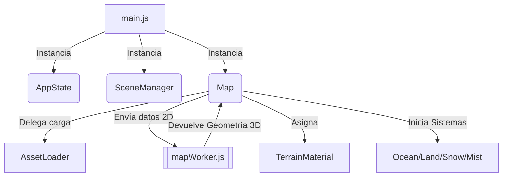

# Documentación Técnica: Proyecto Vekiar

Este documento detalla la arquitectura, el flujo de ejecución, el pipeline de renderizado y las dependencias del proyecto Vekiar. Sirve como guía maestra para retomar el desarrollo sin perder el contexto técnico.

---

## 1. Flujo de Ejecución (Flow)

El programa se inicializa desde el archivo `index.html` e ingresa al flujo principal en `main.js`. El orden de orquestación es estrictamente secuencial para garantizar que los elementos 3D tengan acceso a su estado temporal:

1. **Inicialización (main.js)**: Configura el contenedor DOM y lanza `SceneManager`.
2. **Setup de Three.js (SceneManager)**: Levanta el renderizador, la cámara, el Composer (post-procesado de bloom) y la iluminación global.
3. **Carga de Assets (AssetLoader)**: Antes de construir el terreno, se cargan en paralelo todas las texturas optimizadas y máscaras empacadas.
4. **Construcción del Terreno (Map & mapWorker)**: `Map.js` envía el mapa de alturas a un **Web Worker** en un hilo secundario para calcular los vértices (64 chunks), evitando colapsar el hilo principal.
5. **Inyección de Shaders (TerrainMaterial)**: Se compila el shader maestro que fusiona tierra y agua.
6. **Bucle de Renderizado (AppState)**: El estado del tiempo y las transiciones (ej: zoom in/out) se centralizan en `AppState.js`, el cual dictamina los updates en cadena hacia todos los sub-sistemas (`CameraController`, `OceanSystem`, `LandSystem`, `SnowSystem`).

---

## 2. Arquitectura de Directorios

El proyecto está fuertemente modularizado siguiendo el principio de Responsabilidad Única (SRP):

- **`/js/state/`** (`AppState.js`): Controla el reloj interno del motor, resolviendo bugs de "NaN" en el primer fotograma y transiciones (zoomAlpha).
- **`/js/utils/`** (`AssetLoader.js`): Se encarga exclusivamente de traer las imágenes y configurar sus mipmaps/filtros.
- **`/js/scene/`**:
  - `Map.js`: Ensambla el mapa (chunks de geometría).
  - `TerrainMaterial.js`: Enlaza las variables (uniforms) del JS a la tarjeta gráfica.
  - `SceneManager.js`: Mantiene el `THREE.Scene`, `WebGLRenderer` y luces base.
  - `Clouds.js`: Maneja la capa de nubes perimetrales.
- **`/js/systems/`**: Los "cerebros" lógicos de cada ecosistema.
  - `OceanSystem.js`: Para variables del mar y ríos.
  - `LandSystem.js`: Para variables de tierra.
  - `SnowSystem.js`: Genera las 25.000 partículas leyendo el canvas, las posiciona proceduralmente y controla la luz de nieve.
  - `PermafrostMistMaterial.js`: Humo aditivo para zonas gélidas.
- **`/js/shaders/`**: Toda la matemática de la GPU.
  - `TerrainShader.js`: El orquestador que fusiona los chunks.
  - `/chunks/WaterChunk.js`: Física del océano, caústicas, espuma (foam), ríos y lagos.
  - `/chunks/LandChunk.js`: Acumulación de nieve estacional en el piso, ajustes de color y bordes.
- **`/js/workers/`** (`mapWorker.js`): Corre en un CPU separado. Convierte un PNG plano en mallas 3D topológicas con normales suavizadas.

---

## 3. Pipeline de Generación del Mapa (Data & Textures)

El mapa no es un modelo `.obj` tradicional. Se genera proceduralmente a través de **texturas empacadas** para maximizar rendimiento:

> [!TIP]
> **Optimización extrema:** En vez de cargar 4 imágenes en blanco y negro para máscaras, se unificaron en los distintos canales (R, G, B, A) de un solo PNG.

- **`base_color_map.jpg`**: El color base de la isla.
- **`map_data_R_elevation_B_snow_particles.png`**: 
  - Canal Rojo (R): Mapa de Alturas (Elevación del modelo 3D).
  - Canal Azul (B): Máscara estricta de la nieve para spawnear las **25.000 partículas** en el aire, y difuminado de base de montañas (`blurryMountain`).
- **`masks_1_R_river_G_lake_B_snow.png`**:
  - Canal Rojo (R): Cauces de ríos.
  - Canal Verde (G): Lagos internos.
  - Canal Azul (B): Máscara de **nieve acumulada en el suelo** para el shader.
  - Canal Alpha (A): Vacío (Ocupable para futuras máscaras).
- **`water_noise_distortion.jpg`**: Textura de ruido para animar el oleaje del océano y los bordes.
- **`river_flow_directions.png`**: Direcciones vectoriales para que los ríos fluyan hacia el lado correcto.

> **Nota sobre `source_assets/`**: En `assets/images/source_assets/` se guardan backups e imágenes originales de experimentación (como los heightmaps o biomas separados) que no son cargadas por el juego para preservar la memoria.

El **Worker** lee el canal rojo, eleva los vértices, calcula el sombreado (`computeVertexNormals` propio) y devuelve 64 mallas ("Chunks") a `Map.js` para usar Frustum Culling (Three.js no dibuja los chunks que la cámara no está mirando).

---

## 4. Renderizado Modular de Shaders (GPU)

El terreno usa `THREE.MeshStandardMaterial` que es modificado "al vuelo" mediante la función `onBeforeCompile`.

> [!NOTE]
> Esto nos permite tener la iluminación fotorrealista física nativa de Three.js, pero "hackeada" con nuestras propias matemáticas de agua y nieve.

El código se inyecta utilizando la directiva `#include` de GLSL:
1. Las posiciones topológicas se manipulan en los *Vertex Chunks*.
2. El color es sobrescrito por `LandChunk.js` (tierra y nieve acumulada).
3. Todo es bañado por `WaterChunk.js` (donde haya agua dulce o salada, aplica parallax y caústicas).

---

## 5. Dependencias
- **Three.js** (v150+): Se carga vía CDN o módulo ESM en HTML. Maneja todo el WebGL.
- **OrbitControls**: Modificado localmente (`CameraController.js`) para manejar el "Zoom In" que levanta la cámara de 2D (top-down) a 3D (perspectiva isométrica).
- **Web Workers**: Nativo de HTML5. Requisito estricto: El proyecto siempre debe correrse bajo un servidor HTTP (ej. `python -m http.server`), de lo contrario los workers y las texturas lanzarán error CORS.
